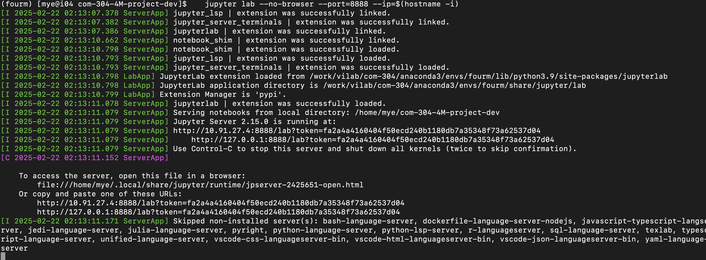
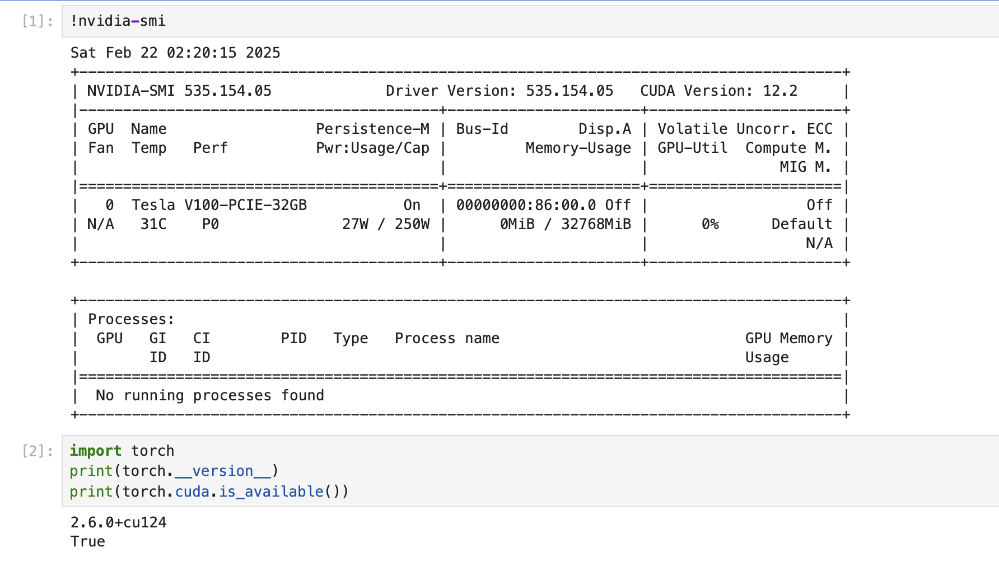

# 4M Homework

We will use `Anaconda` for setting up the Python environment for the 4M tutorial.
We recommend running the Jupyter notebook on the `Izar` cluster of `SCITAS`.

**NOTE**: If you do not wish to use the pre-built anaconda environment, you are welcome to install it in your folder.

## Terminology
The `<user>` mentioned in the following sections is your username on the `Izar` cluster. Please replace it when you execute the commands.

## Connect to the cluster
Open a terminal and use the following command to connect to the Izar cluster. If you do not have an account or need more information about the cluster, please refer to the [SCITAS Tutorial](../SCITAS_Tutorial/scitas_tutorial.md) in this repo.
   ```bash 
    ssh -X <user>@izar.epfl.ch
   ```

## Prepare the workspace folder
1. Create a directory called `COM-304-FM` in `/home/<user>/` on the cluster.
   ```bash
    mkdir /home/<user>/COM-304-FM
    ```
2. Pull the `com-304-FM-project` repository into the `COM-304-FM` folder. (You may need to set up the connection to github, check [here](https://docs.github.com/en/authentication/connecting-to-github-with-ssh/generating-a-new-ssh-key-and-adding-it-to-the-ssh-agent)).
   ```bash
   cd /home/<user>/COM-304-FM
   git clone git@github.com:EPFL-VILAB/com-304-FM-project.git
   ```

## Start the Jupyter notebook server in the compute node
1. Use `tmux` (see a cheat sheet [here](https://gist.github.com/ivankukobko/38ae74ad8eec4090923d346c38824ff4) or at the end of this document in case you are not familiar) to create a non-blocking terminal sessions.
   ```bash
   module load tmux
   tmux new -s jupyter
   ```
2. Get the compute node on the clusters.
   ```bash
   srun -t 120 -A com-304 --qos=com-304 --gres=gpu:1 --mem=16G --pty bash
   ```
3. We have prepared a Conda environment that contains the necessary packages. To activate it, please run:
   ```bash
   source /work/com-304/new_environment/anaconda3/etc/profile.d/conda.sh
   conda init
   conda activate fourm
   ```
- Alternatively, if you prefer to use your own Conda environment, you can install the fourm packages on the fly to ensure you have the latest code updates. This should provide you with the essential environment for running the notebook.
    ```bash
    pip install git+https://github.com/apple/ml-4m.git
    ```
   Note: If you face issues with pip, please ensure your conda related directories have the highest priority in the PATH, i.e. it appears the earliest. 
4. Start the jupyter notebook server.
   ```bash
   cd /home/<user>/COM-304-FM/com-304-FM-project
   jupyter lab --no-browser --port=8888 --ip=$(hostname -i)
   ```
   Its output should be similar to the image below.
    
   Please note the line with the token `<token>` and the IP address `<ip-address>`. You will need it in the next step.
   
   For example, in the image above, the line looks like
   ```
   http://10.91.27.4:8888/lab?token=fa2a4a4160404f50ecd240b1180db7a35348f73a62537d04
   ```
   where the ip address `<ip-address>` is `10.91.27.4` and the token `<token>` is `fa2a4a4160404f50ecd240b1180db7a35348f73a62537d04`.
5. Forward the port from the compute node to your **local machine**, by executing the following command on **your local machine**. Replace `<ip-address>` with the IP address you noted down in the previous step.
   ```bash
   ssh -L 8888:<ip-address>:8888 -l <user> izar.epfl.ch -f -N
   ```
6. On your local machine, open a web browser and enter the following URL. Replace `<token>` with the token you noted down in the previous step.
   ```
   http://127.0.0.1:8888/tree?token=<token>
   ```
7. Check the status of the Jupyter notebook server. You can check the GPU and torch version with the following commands, and you should see something like the following.
    

## Start coding!
Congratulations! You have successfully started the Jupyter notebook server on the compute node. Now you can start coding in the Jupyter notebook.

## **Useful commands for tmux and jupyter**

- Exit the tmux session `ctrl+b` and then type `:detach`
- Scroll inside the tmux session `ctrl+b` and then `[`
- Enter in the tmux session `tmux attach -t <name>`
- Kill the tmux session `tmux kill-session -t <name>`
- Kill a process (after finishing with Jupyter): `lsof -i :8888` and take the id and enter `kill <id>`
