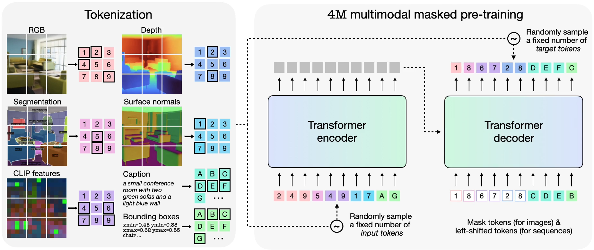

# COM-304: Communication Project. Foundation Model.

The goal of this project is to familiarize you with essential tools such as **[PyTorch](https://pytorch.org/)** and computing clusters like **[SCITAS](https://www.epfl.ch/research/facilities/scitas/)**, which will be used throughout this course. 

Additionally, you will explore the **4M multimodal foundation model**, gaining an understanding of its applications in **generation and retrieval tasks**.

We will also release a nano-4M project, which will help you understand the Multimodal Foundation Model and its applications. And you can create more extensions to the nano-4M model.

To ensure you grasp these concepts, we have designed exercises in the provided Jupyter notebooks. These exercises will help you verify your understanding as you progress through the materials.

## Schedule

- week 1 to week 3: PyTorch tutorial, SCITAS setup, 4M tutorial
- week 4 to week 9: Nano-4M project
- week 10 to week 14: Nano-4M extension

## 1. SCITAS
Follow the provided instructions at [SCITAS Tutorial](https://github.com/EPFL-VILAB/com-304-4M-project-dev/blob/main/SCITAS_Tutorial/scitas_tutorial.md#scitas-tutorial) to set up your **SCITAS environment**.

## 2. PyTorch [Worth 9% of your overall grade]
[PyTorch](https://pytorch.org/) is an **open-source deep learning framework**, which provides a flexible and intuitive way to build deep learning models.
In the [PyTorch_Tutorial](./PyTorch_Tutorial/) folder, you will find three tutorials covering the **basic usage of PyTorch** and the corresponding exercises. If you are already familiar with PyTorch, you can proceed directly to the exercises.

## 3. Multimodal Foundation Model (4M) (Release Soon) [Worth 16% of your overall grade]
After gaining familiarity with PyTorch and SCITAS, you will explore the multimodal foundation model **[4M](https://4m.epfl.ch/)**. This hands-on experience will help you understand the model's key components and how to utilize its pipeline for generation and retrieval tasks.

To get started, follow the instructions in the [4M_Tutorial](./4M_Tutorial/) folder to learn more about the model, set up the required environment, and experiment with the provided Jupyter notebooks!

